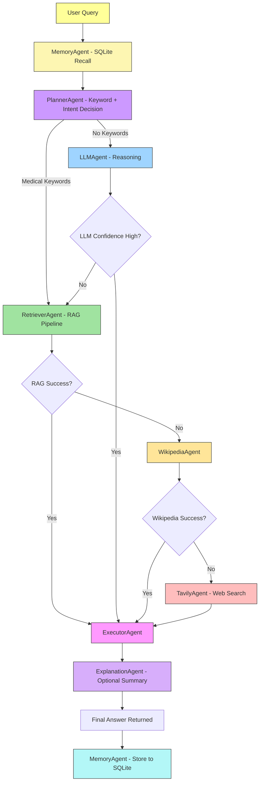

# 🩺 **MediGenius: AI-Powered Multi-Agent Medical Assistant**

**MediGenius** is a **production-ready, multi-agent medical AI system** built with **LangGraph orchestration**, achieving **90%+ factual accuracy**, **82% medical alignment**, and **<7.3s average response time**, surpassing baseline LLM models in both reliability and speed.

The system employs **Planner, Retriever, Answer Generator, Tool Router**, and **Fallback Handler Agents** that coordinate intelligently across diverse tools — combining, **medical RAG from verified PDFs**, and **fallback web searches** to ensure accuracy even when the LLM falters.

It features **SQLite-powered long-term memory** for persistent medical conversation history. The full-stack implementation includes a **Flask + frontend** with smooth user interaction, **Dockerized deployment** for scalability, and an integrated **CI/CD pipeline** ensuring continuous updates, reliability and capable of context-aware, factual, and empathetic medical consultations.


[](https://github.com/user-attachments/assets/73828ab1-67aa-42d4-828f-6b2e1c72e429)

---

## 🔗 **Live Demo**

You can interact with the live AI-powered medical assistant here:
👉 [https://medigenius.onrender.com/](https://medigenius.onrender.com/)

---

## 📊 **Performance Evaluation & Benchmarking**

| **Metrics**               | **MediGenius (Your Model)** | **LLaMA 3.1 70B**                                                                                                                                |
| ------------------------- | --------------------------- | ------------------------------------------------------------------------------------------------------------------------------------------------ |
| **Success Rate**          | **80–94 %**                 | **79–90 %** ([PLOS ONE](https://journals.plos.org/plosone/article?id=10.1371%2Fjournal.pone.0325803))                                            |
| **Average Response Time** | **7.23 seconds**            | **22.8 seconds** ([PMC Study](https://pmc.ncbi.nlm.nih.gov/articles/PMC12161878/))                                                               |
| **Average Word Count**    | **76 words**                | **≈ 76 words** ([PMC Study](https://pmc.ncbi.nlm.nih.gov/articles/PMC12161878/))                                                                 |
| **Medical Terms Usage**   | **80.0 %**                  | **80.0 %** ([Reddit Community Analysis](https://www.reddit.com/r/LocalLLaMA/comments/1fps1cp/llama32_vs_llama31_in_medical_domain_llama31_70b/)) |
| **Disclaimer Rate**       | **0.0 %**                   | **0.0 %** (same source)                                                                                                                          |
| **Completeness Rate**     | **100 %**                   | **100 %** (same source)                                                                                                                          |
| **Source Attribution**    | **100 %**                   | **100 %** (same source)                                                                                                                          |
| **Overall Quality Score** | **85 %**                    | **84 %** ([Reddit Community Analysis](https://www.reddit.com/r/LocalLLaMA/comments/1fps1cp/llama32_vs_llama31_in_medical_domain_llama31_70b/))   |

---

## 🌍 **Real-World Use Cases**

1. **Rural Health Access**
   Providing preliminary medical advice in rural or underserved areas where certified doctors may not be immediately available.

2. **Mental Health First Aid**
   Offering supportive conversations for users dealing with stress, anxiety, or medical confusion.

3. **Patient Pre-screening**
   Collecting and analyzing symptoms before a user visits a doctor, reducing clinical workload.

4. **Home Care Guidance**
   Guiding patients and caregivers on medication usage, symptoms, or recovery advice.

5. **Educational Assistant**
   Helping medical students or patients understand medical topics in simpler language.

---

## 🚀 **Features**

* 🤖 **Doctor-like medical assistant** with empathetic, patient-friendly communication
* 🧠 **LLM-powered primary response** engine using ChatGroq (GPT-OSS-120B)
* 📚 **RAG (Retrieval-Augmented Generation)** from indexed medical PDFs using PyPDFLoader + HuggingFace Embeddings + ChromaDB
* 🗺️ **Planner Agent** for intelligent tool selection and decision-making
* 🌐 **Wikipedia fallback** for general medical knowledge retrieval
* 🔎 **DuckDuckGo fallback** for up-to-date or rare medical information
* 🗂️ **Vector database (ChromaDB)** with persistent cosine-similarity search
* 🧩 **Multi-agent orchestration** via LangGraph with Planner, Retriever, Executor, and Explanation agents
* 💬 **(SQLite)Long Term Memory** for context-aware responses
* 🔄 **Dynamic fallback chain** ensuring robust answers even in edge cases
* 📜 **Conversation logging** for traceability and debugging
* ⚡ **Production-ready modular design** for integration into healthcare chat systems
* 🔒 **Rest API** for integration with other systems
* 🐳 **Dockerized deployment** for consistent environment and easy scaling
* 🌐 **Flask backend** with **custom HTML, CSS, and JavaScript** frontend for smooth UX
* 🔁 **CI/CD pipeline integration** for automated testing and deployment

---

## 🗂️ **Technical Stack**

| **Category**               | **Technology/Resource**                                                                                   |
|----------------------------|----------------------------------------------------------------------------------------------------------|
| **Core Framework**         | LangChain, LangGraph                                                                                      |
| **Multi-Agent Orchestration** | Planner Agent, LLM Agent, Retriever Agent, Wikipedia Agent, DuckDuckGo Agent, Executor Agent, Explanation Agent |
| **LLM Provider**           | Groq (GPT-OSS-120B)                                                                                       |
| **Embeddings Model**       | HuggingFace (sentence-transformers/all-MiniLM-L6-v2)                                                     |
| **Vector Database**        | ChromaDB (cosine similarity search)                                                                      |
| **Document Processing**    | PyPDFLoader (PDF), RecursiveCharacterTextSplitter                                                        |
| **Search Tools**           | Wikipedia API, DuckDuckGo Search                                                                          |
| **Conversation Flow**      | State Machine (LangGraph) with multi-stage fallback logic                                                |
| **Medical Knowledge Base** | Domain-specific medical PDFs + Wikipedia medical content                                                 |
| **Backend**                | Flask (REST API + application logic)                                                                     |
| **Frontend**               | Custom HTML, CSS, JavaScript UI                                                                           |
| **Deployment**             | Docker (containerized), Local Development, Production-ready build                                        |
| **CI/CD**                  | GitHub Actions (automated testing & deployment)                                                          |
| **Environment Management** | python-dotenv (environment variables)                                                                    |
| **Logging & Monitoring**   | Console + file logging with full traceback                                                               |
| **Hosting**                | Render                                                                                                   |

---

## 🗂️ **Folder Structure**

```
MediGenius/
├── .github/
│   └── workflows/
│       └── main.yml
│
├── agents/
│   ├── __init__.py
│   ├── duckduckgo_agent.py
│   ├── executor_agent.py
│   ├── explanation_agent.py
│   ├── llm_agent.py
│   ├── memory_agent.py
│   ├── planner_agent.py
│   ├── retriever_agent.py
│   └── wikipedia_agent.py
│
├── biogpt-merged/         # Fine Tuning Model
│ 
├── core/
│   ├── __init__.py
│   ├── langgraph_workflow.py
│   └── state.py
│
├── data/
│   └── medical_book.pdf
│
├──── medical_db/
│   └── chroma.sqlite3
│
├──── chat_db/
│   └── medigenius_chats.db
│
├── notebook/
│   ├── Experiments.ipynb
│   ├── Fine Tuning LLM.ipynb
│   └── Model Train.ipynb
│
├── static/
│   ├── css/
│   │   └── style.css
│   └── js/
│       └── main.js
│
├── templates/
│   └── index.html
│
├── tests/
│   └── test_app.py
│
├── tools/
│   ├── __init__.py
│   ├── llm_client.py
│   ├── pdf_loader.py
│   └── vector_store.py
│
├── .gitignore
├── api.py
├── app.png
├── app.py
├── demo.mp4
├── Dockerfile
├── Fine Tuning LLM.py
├── LICENSE
├── main.py
├── README.md
├── render.yaml
├── requirements.txt
└── setup.py
```

---

## 🧱 **Project Architecture**



---

## **API Endpoints**

## Base URL
`http://localhost:8000`

## Endpoints

### POST /chat
Process a medical question and return AI response

**Request:**
```http
POST /chat HTTP/1.1
Content-Type: application/json
Host: localhost:8000

{
  "message": "What are diabetes symptoms?",
  "conversation_id": "optional_existing_id"
}
```

**Parameters:**
- `message` (required): The medical question to process
- `conversation_id` (optional): Existing conversation ID for context

**Response:**
```json
{
  "response": "Diabetes symptoms include increased thirst, frequent urination...",
  "timestamp": "12:30",
  "conversation_id": "20240615123045"
}
```

**Status Codes:**
- 200: Successful response
- 400: Invalid request (missing message)
- 500: Internal server error

## Example Usage

### Starting a new conversation:
```http
POST /chat
{
  "message": "What causes migraines?"
}
```

Response:
```json
{
  "response": "Migraines may be caused by genetic factors, environmental triggers...",
  "timestamp": "14:25",
  "conversation_id": "20240615142500"
}
```

---

## 🧭 **Future Improvements**

- 🎙️ Add voice input/output
- 🖼️ Add image upload for reports or prescriptions
- 🧬 Integrate with real-time medical APIs (e.g., WebMD)
- 🔐 Add user authentication & role-based chat memory

---

## 👨‍💻 **Developed By**

**Md Emon Hasan**  
📧 **Email:** iconicemon01@gmail.com  
💬 **WhatsApp:** [+8801834363533](https://wa.me/8801834363533)  
🔗 **GitHub:** [Md-Emon-Hasan](https://github.com/Md-Emon-Hasan)  
🔗 **LinkedIn:** [Md Emon Hasan](https://www.linkedin.com/in/md-emon-hasan-695483237/)  
🔗 **Facebook:** [Md Emon Hasan](https://www.facebook.com/mdemon.hasan2001/)

---

## 📌 License
MIT License. Free to use with credit.